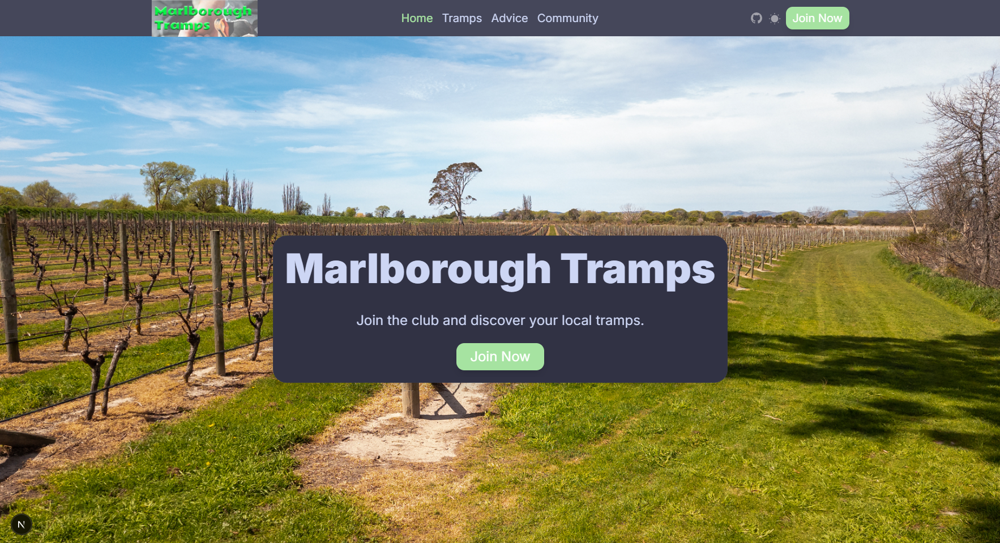
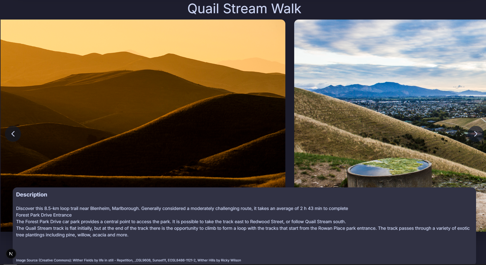

# school-website-2025

- [x] designs

- [x] Pages:

  - [x] Home
  - [x] Tramps - stats: difficulty, distance, and key features.
  - [x] Tramping advise - gear
  - [x] Privacy policy
  - [x] Community
  - [x] Navbar
  - [x] Footer

- [ ] Responsive pages:

  - [ ] Home
  - [x] Tramps
  - [x] Tramping advise
  - [x] Privacy policy
  - [x] Community
  - [x] Navbar
  - [x] Footer

- [ ] Features:
  - [x] Form to sign up to group tramps
  - [x] Dark mode
  - [x] Comments [elfsight](https://elfsightcdn.com)

react framework - [NextJS](https://nextjs.org/docs/app/getting-started/installation)

hero page design - [https://prismic.io/blog/website-hero-section](https://prismic.io/blog/website-hero-section)

palette - [catppuccin](https://www.npmjs.com/package/@catppuccin/palette)

styling - [tailwind](https://tailwindcss.com/docs/)

## 1. Purpose of the Outcome:
The purpose of this project is to create a website for a tramping club that allows members to find and organize local group tramps, share track information, and engage with the tramping community. The website should be easy to use, visually appealing, and functional across multiple devices.

The Marlborough Tramps website was successfully created using Next.js with React components and Tailwind CSS styling. The website provides a modern, responsive platform for tramping club members to:

- Browse three featured hiking tracks (Nydia Track, Quail Stream Walk, Wairau Lagoons)
- Sign up for group tramps via an email modal form
- Access tramping advice and safety information
- Engage with the community through a comments section

## 2. Requirements of the End Users:
The primary users of the website are members of the tramping club, who are likely outdoor enthusiasts, hikers, and nature lovers. They need a platform that:
### Provides clear information on three hiking tracks, including difficulty, distance, and key features.
### Offers a pop-up (modal) form to sign up for group tramps.
### Is accessible and usable on mobile devices, as many users may access the site while on the go.
### Offers advice on tramping procedures
### Creates three web pages, with combinations of images and text.
### Adds appropriate headings and subheads
### Uses images, logo and provided by the stakeholder (see Tramping images folder)
### Uses the contact address details:
Blenheim Office				Picton Office
5 Stephenson St				173 Waikawa Road
Blenheim					Picton
Cell 021 578 0119				Cell 021 573 6558
Email: admin@marlboroughtramps.co.nz
			
## 3. Website Creation Using Appropriate Tools, Techniques, and Conventions:
Create the website using the following tools, techniques, and industry conventions:
### Responsive Design: Ensure the website works seamlessly on multiple devices (e.g., desktops, tablets, smartphones). 
### Interactivity: Implement interactive features such as:
#### A collapsible navigation menu for easy access on smaller screens.
#### Buttons that change appearance on hover or click to provide visual feedback.
#### An image slideshow to display photos from past walks.
### Industry guidelines (conventions) including semantic HTML: Structure your HTML using semantic elements to improve accessibility, SEO, and maintainability.
### Apply relevant website conventions (eg semantic HTML and design principles) and apply these to improve the quality of the website. 
### Apply appropriate data integrity and testing procedures. Use these to continually  improve the quality and functionality of the website throughout the design, development and testing procedures.
### Apply user experience principles relevant to the purpose of the website. Use these to iterativel;y improve the quality of the website
### Address implications relevant to the website and its development. 
## 4. Addressing Relevant Implications (at least three):
Ensure that the website addresses the relevant implications:
### Social and Cultural
### Legal & Intellectual Property
### Privacy/Confidentiality
### Accessibility & Usability & Aesthetics
### Functionality - works
### Sustainability and Future-Proofing - using easy framework
### End-User Considerations

## 5. Applying User Experience (UX) Principles (at least two):
### Accessibility
### Focus on the Target User: 
### Consistency
### Simplicity
### Font Styling (Typography)
### Usability Testing
### Providing Feedback

## 6. Applying Data Integrity and Testing Procedures (at least three):
### Data Integrity: Validate form inputs (e.g., user sign-ups) to ensure correct and reliable data.
### Testing:
#### Test the website’s responsiveness on different devices and screen sizes.
#### Ensure all interactive elements work as intended.
#### Check for accessibility issues, such as missing alt text or insufficient contrast.
#### Use tools like the W3C Validator to validate HTML and CSS. Correct any errors.
#### Conduct usability testing with the stakeholder and actual users, gathering feedback to improve the site’s functionality and user experience.

## Merit Level:
### Apply UX Principles for Quality Improvement:
#### Use feedback from usability tests to iteratively enhance the website.
#### Experiment with different design elements (e.g., colour schemes, typography) to find the most effective combinations.
#### Incorporate Google Fonts for better typography and use normalize.css for consistent styling across browsers.
#### Apply design techniques like partial transparency, link state styling, and CSS Grid for a polished, professional look.

## Excellence Level:
### Continual Improvement:
#### Begin by designing the homepage and seek feedback from end-users on both its appearance and functionality.
#### Implement suggested changes, then expand the website by adding more pages and features.
#### Regularly test and refine the website throughout the development process, keeping detailed records of all improvements made based on testing results.

### Efficient Tools and Techniques:
#### Use wireframes and concept sketches to plan the website’s design.
#### Take advantage of shortcuts and tools like Visual Studio Code and Google Chrome DevTools for efficient coding and debugging.
#### Optimize images using tools like https://tinypng.com/ to ensure fast loading times.
#### Apply mobile-first design principles, ensuring the website is fully functional on mobile devices before scaling up to larger screens.
#### Comment your code clearly to make it easier to understand and maintain.
#### Use descriptive class and ID names
#### Validate HTML and CSS code

## Evidence to be submitted:
### 1. Submit the completed website in zip format, containing HTML, CSS and media files
### 2. A written description of how you addressed the relevant implications
### 3. Records of how you completed data integrity and testing procedures when developing the website. This could include:
#### a testing table
#### annotated screenshots (eg showing the version of a webpage you tested and the changes made as a consequence of testing)
#### a video of no more than 3 minutes showing how you conducted the testing
#### stakeholder feedback records
#### screenshots of completed validation procedures etc