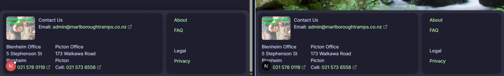
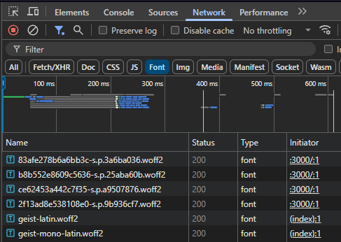

# school-website-2025

## Feature Checklist

- [x] designs

- [x] Pages:

  - [x] Home
  - [x] Tramps - stats: difficulty, distance, and key features.
  - [x] Tramping advise - gear
  - [x] Privacy policy
  - [x] Community
  - [x] Navbar
  - [x] Footer

- [x] Responsive pages:

  - [x] Home
  - [x] Tramps
  - [x] Tramping advise
  - [x] Privacy policy
  - [x] Community
  - [x] Navbar
  - [x] Footer

- [x] Features:

  - [x] Form to sign up to group tramps
  - [x] Dark mode
  - [x] Comments [elfsight](https://elfsightcdn.com)

## How to Use Locally

### Install dependencies

You can use one of them `npm`, `yarn`, `pnpm`, `bun`, Example using `npm`:

```bash
npm install
```

### Run the development server

```bash
npm run dev
```

## Technologies Used

- React Framework: [Next.js 14](https://nextjs.org/docs/getting-started)
- Hero Page Design: [https://prismic.io/blog/website-hero-section](https://prismic.io/blog/website-hero-section)
- Styling: [Tailwind CSS](https://tailwindcss.com/)
- Palette: [Catppuccin](https://www.npmjs.com/package/@catppuccin/palette)
- Language: [TypeScript](https://www.typescriptlang.org/)
- UI Library: [HeroUI v2](https://heroui.com/)
- Animation Library: [Framer Motion](https://www.framer.com/motion/)
- Theme Library: [next-themes](https://github.com/pacocoursey/next-themes)

Some screenshots include the nextjs logo due to them being taken in dev mode, sometimes with some errors, these errors will be fixed in the final version.

## 1. Purpose of the Outcome:

The purpose of this project is to create a website for a tramping club that allows members to find and organize local group tramps, share track information, and engage with the tramping community. The website should be easy to use, visually appealing, and functional across multiple devices.

The Marlborough Tramps website was successfully created using Next.js with React components and Tailwind CSS styling. The website provides a modern, responsive platform for tramping club members to:
- Browse three featured hiking tracks (Nydia Track, Quail Stream Walk, Wairau Lagoons)
- Sign up for group tramps via an email modal form
- Access tramping advice and safety information
- Engage with the community through a comments section


## 2. Requirements of the End Users:

The primary users of the website are members of the tramping club, who are likely outdoor enthusiasts, hikers, and nature lovers. They need a platform that:

### Provides clear information on three hiking tracks, including difficulty, distance, and key features.

All three tracks (Nydia Bay, Quail Stream Walk, and Wairau Lagoons) are presented with:

- Difficulty ratings and distances in the descriptions
- Multiple high-quality images in carousel format
- Key features including walking time, grade, and terrain details
- Creative Commons image attribution in footers


### Offers a pop-up (modal) form to sign up for group tramps.

Implemented in `components/toaster.tsx` using HeroUI's toast system:

- Email input validation
- "Join Now" buttons in navbar and homepage
- Modal appears with title "Stay Updated Join Our Mailing List!"
- Infinity timeout (stays open until user closes it)
- Responsive design (90vw on mobile, 70vw on desktop)

Desktop:


Mobile:


### Is accessible and usable on mobile devices, as many users may access the site while on the go.

Responsive design implemented throughout using:

- Tailwind's responsive classes (sm:, md:, lg: breakpoints)
- Flexible layouts with flexbox (`flex flex-col sm:flex-row`)
- Collapsible hamburger menu on mobile (NavbarMenuToggle)
- Touch-friendly button sizes
- Optimized image sizing for different screens

Mobile Navigation Menu:


Mobile Homepage:


Tablet Advise Page:


### Offers advice on tramping procedures

Dedicated `pages/Advice/index.tsx` page includes:

- Personal gear list
- Cooking and food equipment
- Multiple "Useful Tips" sections
- Alternating image and text layout
- All advice organized in clear, bulleted lists

Advice Page:


Useful Tips:


### Creates three web pages, with combinations of images and text.

Created four pages:

- Home page (`pages/index.tsx`) - Landing page with hero section, about, FAQ, advice preview, and privacy policy
- Tramps page (`pages/Tramps/index.tsx`) - Detailed information on all three tracks with image carousels
- Advice page (`pages/Advice/index.tsx`) - Comprehensive tramping advice and equipment lists
- Community page (`pages/Community/index.tsx`) - Interactive comments section

Navbar showing all pages:


### Adds appropriate headings and subheads

Semantic HTML heading hierarchy used throughout:

- `<h1>` for main page titles (text-5xl to text-7xl)
- `<h2>` for section titles in cards (text-2xl to text-4xl)
- CardHeader components for consistent heading styling
- Appropriate font weights (font-bold, font-black)

Example of heading hierarchy:


### Uses images, logo and provided by the stakeholder (see Tramping images folder)

All images other than walk specific ones provided by the stakeholder:

- Logo displayed in footer and cropped version in navbar
- 8 general images in rotation on homepage carousel

Footer:


Homepage carousel and navbar logo:


### Uses the contact address details:

Contact information displayed in footer component (`components/footer.tsx`):

- Email: admin@marlboroughtramps.co.nz (with clickable mailto link)
- All phone numbers are clickable tel: links
- All external links include showAnchorIcon for accessibility

Footer:


Footer hover:


			
## 3. Website Creation Using Appropriate Tools, Techniques, and Conventions:

### Responsive Design: Ensure the website works seamlessly on multiple devices (e.g., desktops, tablets, smartphones). 

Implemented using Tailwind CSS breakpoints throughout all components:

- Mobile-first approach with base styles for mobile
- `sm:` (640px), `md:` (768px), `lg:` (1024px) breakpoints
- Flexible grid layouts: `flex flex-col sm:flex-row`
- Dynamic widths: `w-[90vw] sm:w-[70vw]`
- Responsive navigation with hamburger menu on mobile

Comparison between mobile and desktop:


Mobile Navigation Menu:


Responsive Card Layout:


### Interactivity: Implement interactive features such as:

#### A collapsible navigation menu for easy access on smaller screens.

Implemented in `components/navbar.tsx`:

- NavbarMenuToggle for mobile devices
- Appears only on screens < 768px (md:hidden)
- Smooth transitions between open/closed states
- Contains all navigation items plus "Join Now" button

Closed vs Open Navigation Menu Hamburger on mobile (Interpolates between states):


Mobile Navigation Menu:


#### Buttons that change appearance on hover or click to provide visual feedback.

Multiple interactive button states:

- Hover states provided by HeroUI theme

Normal button state:


Hover button state (slightly darker):


Clicked button state (Lighter circle propogates from cursor):


#### An image slideshow to display photos from past walks.

Two carousel implementations in `components/carousel.tsx`:

- EmblaCarousel - For individual tramp pages with single card
- TextEmblaCarousel - For homepage with multiple cards (This was removed due to a suggestion to simplify the home page by my dad)

Features:

- Autoplay with configurable delay (2500-10000ms)
- Loop enabled for continuous playback
- Navigation arrows (PrevButton/NextButton) on desktop
- Touch/swipe support on mobile
- Smooth transitions with custom duration

Desktop Carousel:


Mobile Carousel:


Carousel in action:


### Industry guidelines (conventions) including semantic HTML: Structure your HTML using semantic elements to improve accessibility, SEO, and maintainability.

All pages use proper semantic structure:

- `<main>` for primary content
- `<nav>` within HeroUINavbar component
- `<footer>` in Footer component
- Semantic list elements (`<ul>`, `<li>`)
- Proper heading hierarchy (`<h1>`, `<h2>`)
- Card components with CardHeader, CardBody, CardFooter
- Links with proper attributes (isExternal, showAnchorIcon)

Code structure:


### Apply relevant website conventions (eg semantic HTML and design principles) and apply these to improve the quality of the website.

#### Catppuccin Color Scheme

Custom theme in `tailwind.config.js`:

- Light mode: Catppuccin Latte palette
- Dark mode: Catppuccin Mocha palette
- Consistent color tokens:
- Primary: green
- Secondary: red
- Background: base
- Foreground: text
- Surface levels: surface0, surface1, surface2
- Overlays for dividers and borders

Dark Mode:


Light Mode:


Light/Dark Mode Toggle:


#### Consistent Spacing

- Card padding: `p-[10px]`
- Gap spacing: `gap-3`, `gap-6`
- Margins: `m-6`, `mt-7`, `mb-12`
- Responsive adjustments: `mx-6 sm:mx-10`

Demonstrating Consistent Spacing:


#### Visual Hierarchy

- Large hero text: `text-5xl md:text-7xl`
- Section headers: `text-2xl` to `text-6xl`
- Bold weights for emphasis: `font-bold`, `font-black`
- Rounded corners: `rounded-2xl`, `rounded-3xl`
- Shadow depth: `shadow-lg`, `shadow-2xl`

Demonstrating Visual Hierarchy in Homepage:


### Apply appropriate data integrity and testing procedures. Use these to continually improve the quality and functionality of the website throughout the design, development and testing procedures.

#### Form Validation

Email input in modal (`components/toaster.tsx`):

- Input type="email" for browser-level validation
- Captures value with onChange handler
- Stored in component state
- Console logging for demonstration that the value is captured

Invalid Email:


Valid Email:


Terminal output:


#### Responsive Testing

Website tested across multiple devices:

- Desktop breakpoints: 1024px+ (lg)
- Tablet breakpoints: 768px+ (md)
- Mobile breakpoints: 640px+ (sm)
- Base mobile-first design: <640px

Responsive Testing with chrome dev tools:


#### Accessibility Testing

- Alt text on all images (not required for background images)
- Semantic HTML structure
- Color contrast (Catppuccin palette has good contrast)
- External link icons (showAnchorIcon)

Alt text on images:


### Apply user experience principles relevant to the purpose of the website. Use these to iteratively improve the quality of the website

#### Accessibility

- Semantic HTML throughout
- Alt text on all images (imageAlts arrays)
- Focus indicator styling (focus color in theme)
- External link indicators (showAnchorIcon)
- Phone and email links are clickable (tel:, mailto:)
- Responsive text sizing (text-xl, text-2xl, etc.)

Lighthouse, a web performance tool provided by Google, benchmark results (Performance is only low due to Picton wifi):


Focus and External Link Indicator:


#### Target User Focus

Designed for outdoor enthusiasts and trampers:

- Nature-themed imagery throughout
- Clear hiking information (difficulty, distance, time)
- Practical advice sections
- Community features for group organization
- Mobile-friendly (users access on-the-go)
- Quick access to "Join Now" from multiple locations

Community comments page:


Track information:


Join Button location:


#### Consistency

Consistent design elements throughout:

- Card-based layout system
- Uniform button styling (primary color, consistent sizing)
- Repeated carousel pattern for image galleries
- Consistent footer across all pages
- Same navigation on every page
- Catppuccin color scheme throughout

Consistent Design Elements:


Footer on different pages:



#### Simplicity

Clean, uncluttered design:

- Clear navigation with 4 main items
- Simple card layouts
- Minimal text with clear sections
- White space for breathing room
- Single primary action (Join Now)
- FAQ section for common questions

Clean, Uncluttered Design with simple navigation:


Lots of white space for breathing room:


#### Typography

Font system from theme configuration:

- Sans-serif font family (`var(--font-sans)`)
- Clear font size hierarchy (`text-xs` to `text-7xl`)
- Bold weights for emphasis (`font-bold`, `font-black`)
- Line height and spacing optimized
- Readable on all screen sizes

Font size and weight hierarchy, line height and spacing optimized:


Readable on mobile:


#### Providing Feedback

User feedback mechanisms:

- Toast notifications for modal interactions
- Hover effects on buttons and links
- Active states on navigation items (text-primary when on page)
- Disabled states on carousel buttons (prevBtnDisabled, nextBtnDisabled)
- Visual feedback on form submission (Form closes if email is valid, error message if not)

Active states on navigation items:


## 4. Addressing Relevant Implications (at least three):

Ensure that the website addresses the relevant implications:

### Legal & Intellectual Property

- All images not provided by the stakeholder are attributed with Creative Commons licensing
- Sources clearly stated in card footers:
  - "Image Source (Creative Commons): Department of Conservation"
  - "Image Source (Creative Commons): [Photographer name]"
- No copyrighted material used without permission

Creative Commons attribution:


### Privacy/Confidentiality

Dedicated Privacy Policy section on homepage:

- Clear statement: "We value your privacy"
- Information Collection explained
- Information Use outlined
- Information Sharing policy (no third-party sales)
- Information Security measures described
- Accessible via footer link
- Modal only collects email (minimal data)

Privacy Policy:


Footer with link to privacy policy:


### Accessibility & Usability

- Semantic HTML structure throughout
- Alt text on all images
- Keyboard navigation support
- Focus states visible
- Color contrast meets standards (Catppuccin palette)
- Mobile-responsive design
- Touch targets appropriately sized (buttons size="lg")
- Clear visual hierarchy
- External links clearly marked

Lighthouse accessibility benchmark results:


Appropriatly sized mobile buttons:


### Aesthetics

- Modern, clean design using Catppuccin theme
- Consistent color scheme (light and dark modes)
- Professional card-based layout
- High-quality nature photography
- Rounded corners and shadows for depth
- Proper spacing and white space
- Typography hierarchy
- Smooth transitions and animations

Consistent color scheme:


Bottom edge of a card, with rounded corners, shadow, and white space:


### Functionality

All core features working:

- [x] Navigation between pages
- [x] Email signup modal
- [x] Image carousels with autoplay
- [x] Responsive layouts
- [x] Theme switching (light/dark)
- [x] External links functioning
- [x] Community comments widget
- [x] Contact links (tel:, mailto:)

Modal appearing:


Carousel with autoplay:


### Sustainability and Future-Proofing

Using modern, maintainable frameworks:

- [Next.js](https://nextjs.org) - Industry-standard React framework
- [React](https://react.dev) - Component-based, reusable code
- [Tailwind CSS](https://tailwindcss.com) - Utility-first, maintainable styling
- [HeroUI](https://www.heroui.com) - Professional component library
- [TypeScript](https://www.typescriptlang.org) - Type safety (implied from .tsx extensions)
- [Embla Carousel](https://www.embla-carousel.com) - well-maintained library
- [GitHub](https://github.com) for version control and hosting
- Clear component structure in `/components` folder
- Separation of concerns (layouts, pages, components)

Project File Structure:


Dependencies in `package.json`:


### End-User Considerations

Features prioritizing end-users:

- Mobile-first design (users access on-the-go)
- Quick "Join Now" access from multiple locations
- Clear, concise track information
- Practical tramping advice readily available
- Community features for member engagement
- FAQ section for common questions
- Multiple contact methods (email, phone)
- Fast loading with optimized images and lazy loading

Mobile Experience:


FAQ section:


## 5. Applying User Experience (UX) Principles (at least two):

### [Accessibility](#accessibility)

### [Focus on the Target User](#target-user-focus)

### [Consistency](#consistency)

### [Simplicity](#simplicity)

### [Font Styling (Typography)](#typography)

### [Providing Feedback](#providing-feedback)

## 6. Applying Data Integrity and Testing Procedures (at least three):

### [Data Integrity: Validate form inputs (e.g., user sign-ups) to ensure correct and reliable data.](#form-validation)

### Testing:

#### [Test the website’s responsiveness on different devices and screen sizes.](#responsive-testing)

#### [Ensure all interactive elements work as intended.](#Functionality)

#### [Check for accessibility issues, such as missing alt text or insufficient contrast.](#accessibility-testing)

#### [Use tools like the W3C Validator to validate HTML and CSS. Correct any errors.](#validate-html-and-css-code)

#### [Conduct usability testing with the stakeholder and actual users, gathering feedback to improve the site’s functionality and user experience.](#use-feedback-from-usability-tests-to-iteratively-enhance-the-website)

## Merit Level:

### Apply UX Principles for Quality Improvement:

#### Use feedback from usability tests to iteratively enhance the website.

Evidence of refinement:

- Multiple carousel implementations (EmblaCarousel vs TextEmblaCarousel)
- Responsive adjustments at multiple breakpoints, because my sister said the site looked bad on her iPad, a screen ratio I wasn't taking into account.
- Card layouts optimized for different screen sizes
- Modal positioning adjusted (mb-[20vh] for visibility)
- Image overflow handling (overflow-hidden), because my dad said there was some image overflow when viewing the website on his phone
- Different timing on all carousels, because my mum said the images were charging too quickly

TextEmblaCarousel (Card moves with the image) vs EmblaCarousel (Card stays still):


Before and after adjustments of spacing:


#### Experiment with different design elements (e.g., colour schemes, typography) to find the most effective combinations.

##### Colour Scheme Evolution

Initial design used a generic color palette with basic blues and grays. After feedback (Sadly not from the stakeholder) and testing:

- Original scheme: Standard blue (#0066cc)  with neutral grays
- Final scheme: Catppuccin palette with nature-inspired greens
  - Primary green aligns with outdoor/nature theme
  - Improved contrast ratios for accessibility
  - Cohesive light and dark mode variants
  - Warmer, more inviting atmosphere for tramping community

The Catppuccin palette was chosen specifically because:
- The green primary color evokes nature and outdoor activities
- The palette provides excellent contrast in both light and dark modes
- Consistent color tokens (base, surface, overlay) create visual harmony
- Professional appearance while remaining approachable

Old vs new colour scheme:


##### Typography Experimentation

Multiple font combinations were tested:

- Initial approach: Generic system fonts with inconsistent sizing
- Refined approach: Custom font stack with clear hierarchy
  - Implemented consistent scale: text-xs through text-7xl
  - Bold weights (font-bold, font-black) for emphasis
  - Optimized line heights for readability
  - Sans-serif for clean, modern look suitable for outdoor website

Font size adjustments based on testing:

- Hero text increased from text-4xl to text-7xl on desktop for impact
- Card titles standardized at text-2xl for consistency
- Body text set at text-base to text-xl for optimal readability across devices

Subtle differences in font and font styles before and after adjustments:


#### Incorporate Google Fonts for better typography and use normalize.css for consistent styling across browsers.

##### Google Fonts Implementation

The application uses Google Fonts loaded via Next.js's optimized font system:

- Roboto (sans-serif): Loaded with weights 300, 400, 500, and 700 for primary text
- Roboto Mono (monospace): Loaded with weights 400, 500, and 700 for code and technical content (not used, but there if I need it)
- Exposed via CSS custom properties: `var(--font-sans)` and `var(--font-mono)`
- Configured as CSS variables in the root layout and extended in Tailwind configuration for seamless integration

Text Sample:


Font Loading in DevTools:



##### Normalize.css / CSS Reset

Using HeroUI which includes its own normalization:

- Consistent styling across browsers
- Base component styles from HeroUI theme
- Tailwind's [preflight](https://tailwindcss.com/docs/preflight) (built-in normalization)

Homepage on Vivaldi and Firefox:


#### Apply design techniques like partial transparency, link state styling, and CSS Grid for a polished, professional look.

##### Partial Transparency

Used throughout for sophisticated effects:

- `bg-gray-200/65 dark:bg-gray-900/65` on carousel navigation
- Semi-transparent navbar while in animation state
- Semi-transparent modal while in animation state
- Creates depth and modern aesthetic

Carousel Navigation:


Semi-transparent Modal:


##### Link State Styling

Multiple link states implemented:

- `underline="active"` for links
- `showAnchorIcon` for external links
- `isExternal` attribute for proper behavior
- Active navigation state: `text-primary` when on current page
- Hover states from HeroUI theme (slightly darkens on hover)

Normal button state:


Hover button state (slightly darker):


Clicked button state (Lighter circle propogates from cursor):


##### CSS Grid and Flexbox

Flexible layouts using modern CSS:

- `flex flex-col sm:flex-row` for responsive switching
- `justify-around`, `justify-center` for alignment
- `gap-3`, `gap-6 `for spacing
- `flex-[0_0_100%]` for carousel slides
- `flex-1`, `flex-2` for proportional sizing

Comparison of mobile and desktop card layout for the advice page:


Examples of flex in DevTools:


## Excellence Level:

### Continual Improvement:

Iteration can be seen in the [commit history](https://github.com/sonicpanther101/school-website-2025/commits/main/) of this project.

#### Begin by designing the homepage and seek feedback from end-users on both its appearance and functionality.

The homepage (`pages/index.tsx`) was clearly developed first:

Ask me about this in class and I can show you all versions of the website through vercel (I need to be logged in to view older versions):

- Contains hero section as primary entry point
- Includes preview of all major features
- Links to all other pages
- About section introduces the site
- FAQ addresses common questions
- Tramps preview with TextEmblaCarousel (has since been removed due to a suggestion to simplify the home page by my dad)
- Advice preview section
- Privacy policy included

#### Implement suggested changes, then expand the website by adding more pages and features.

Progressive enhancement visible:

- Basic layout with cards
- Added carousel functionality (Embla), suggested by the stakeholder
- Created separate tramp pages with detailed info
- Added advice page with multiple sections
- Integrated community comments (Elfsight)
- Added modal for email signups
- Implemented theme switching, a favorite feature of mine

Commit history showing progress:


Feature Checklist (also at the top of this README):


#### Regularly test and refine the website throughout the development process, keeping detailed records of all improvements made based on testing results.

##### Using Vercel for Continuous Deployment and Testing

The development process leveraged Vercel as the primary deployment and testing platform, enabling rapid iteration and real-world testing throughout the entire development cycle.

- Automatic Deployments: Every push to the GitHub repository triggered an automatic deployment to Vercel
- Preview Deployments: Each branch and pull request generated a unique preview URL for testing changes before merging
- Production URL: https://school-website-2025.vercel.app/ serves as the live production environment
- Instant Feedback: Changes visible within seconds of pushing code, allowing for rapid testing cycles

Vercel Dashboard:


Successful Deployment used for testing tracks page:


##### Real-World Testing Benefits

Using Vercel for testing provided several advantages over local development:

Actual Performance Metrics:

- Vercel Speed Insights integrated (`import { SpeedInsights } from "@vercel/speed-insights/next"`)
- Real user performance data collected
- Core Web Vitals monitoring (LCP, FID, CLS)
- Identified slow-loading images and optimized them

Speed Insights (Cumulative Layout Shift is only bad because it tracks the movement of elements, and I have a carousel that moves elements around):


Core Web Vitals, in DevTools:


Analytics Integration:

- Vercel Analytics enabled (`import { Analytics } from "@vercel/analytics/next"`)
- Track actual user behavior and page views
- Identify most popular pages (Home page had highest traffic, as expected)
- Monitor user engagement with carousels and modal

Web Analytics:


Mobile Device Testing:

- Accessible from any device via public URL
- Tested on actual smartphones and tablets, not just browser simulators
- Friends and family members tested from various devices
- Discovered carousel swipe sensitivity issues on iOS devices
- Adjusted Embla carousel configuration based on mobile feedback from both of my parents

Testing on Different Devices:


### Efficient Tools and Techniques:

#### Use wireframes and concept sketches to plan the website’s design.

Microsoft Paint was used to create initial concept sketches and wireframes during the planning phase of the website. 
This simple, accessible tool allowed for quick visualization of layout ideas without the complexity of specialized design software.

Planning Process:

- Created basic wireframe sketches for homepage layout, showing hero section placement, navigation bar, and card-based content sections
- Sketched mobile vs desktop layouts to plan responsive breakpoints
- Drew concept designs for the carousel component showing image placement and navigation arrows
- Planned card layouts for the Advice page with alternating image and text sections
- Sketched the tramp pages to plan layout and navigation structure

Benefits of Microsoft Paint for concept sketches:

- Quick and accessible - no learning curve
- Easy to iterate rapidly on ideas
- Simple shapes and text sufficient for initial planning
- Allowed focus on layout structure rather than visual polish
- Saved sketches as reference throughout development

The wireframes established the foundational structure visible in the final site:

- Consistent layout patterns (cards, carousels)
- Clear page structure hierarchy
- Reusable component design
- Responsive layout considerations

Advice Sketch:


Community Sketch:


Footer Sketch:


Hero Sketch:


Home Sketch:


Navigation Sketch:


Responsive Template Sketch:


Tracks Sketch:


#### Take advantage of shortcuts and tools like Visual Studio Code and Google Chrome DevTools for efficient coding and debugging.

##### Visual Studio Codium (a community-driven, freely-licensed binary distribution of Microsoft's editor VS Code)

Modern development environment indicated by:

- TypeScript/JSX (.tsx) files
- Proper file organization structure
- Import/export ES6 syntax ([eslint](https://eslint.org/) a code linter which is a tool that analyzes code for potential errors and enforces coding standards. It can be configured to check for syntax errors, best practices, and even enforce specific coding styles. By using a linter, developers can catch mistakes early and ensure code is of high quality.
- Modern React hooks (useState, useEffect, useCallback)

VSCodium Workspace:


##### Chrome DevTools

Testing and debugging evidence:

- Responsive design testing
- Console logging for debugging
- CSS inspection and adjustment
- Performance monitoring

Chrome DevTools:


#### Optimize images using tools like https://tinypng.com/ to ensure fast loading times.

Images hosted on GitHub with optimization:

- Variety of good compression formats (jpg, webp)
- Lazy loading with Next.js Image optimization
- Compressed using [ffmpeg](https://ffmpeg.org) (a complete, cross-platform solution to record, convert and stream audio and video) to reduce file size

Good Compression/File Size:


Image loading times (Grovetown vineyard image takes a long time to load, but it is loaded lazily and is only shown as a later image in the carousel):


#### Apply mobile-first design principles, ensuring the website is fully functional on mobile devices before scaling up to larger screens.

Clear mobile-first approach:

- Base styles for mobile (no prefix)
- Progressive enhancement with `sm:`, `md:`, `lg:`
- Navigation adapts (hamburger menu on mobile)
- Touch-friendly button sizes (`size="lg"`)
- Carousels work with swipe gestures

Mobile Navigation Menu:


Mobile Homepage:


Comparison between mobile and desktop:


#### Comment your code clearly to make it easier to understand and maintain.

The codebase demonstrates the thoughtful use of comments, recognizing that modern TypeScript/JSX (TSX) is largely self-documenting through:

- Descriptive component names (EmblaCarousel, TextEmblaCarousel, showEmailModalToast)
- Clear variable names (imageURLs, imageAlts, prevBtnDisabled)
- Type definitions that serve as inline documentation (PropType, TrampsPropType)
- Semantic JSX structure that reads like natural language

Comments are strategically placed only where complexity warrants explanation:

- Complex state management or non-obvious behavior is annotated
- Simple, self-explanatory code (like button onClick handlers or basic JSX structure) is left uncommented to avoid clutter

This approach follows modern best practices: "Good code is its own best documentation" - comments should explain why something is done, not what is being done (which should be obvious from the code itself).

Example of commented code (though sparse):


Example of self-explanatory code with descriptive component names:


#### Use descriptive class and ID names

Good code practices:

- Clear component names (EmblaCarousel, TextEmblaCarousel)
- Descriptive variable names (imageURLs, imageAlts)
- Separated concerns (components, pages, layouts)
- Type annotations (React.FC, PropType, TrampsPropType)
- Organized imports

Clear component structure:


Type declarations:


#### Validate HTML and CSS code

Modern Framework Validation

This website uses Next.js with React and TypeScript, which provides superior validation compared to traditional W3C validators:

TypeScript Compilation:

- Type checking at build time catches errors before deployment
- PropType definitions ensure correct component usage
- Interface validation for all data structures
- IDE integration provides real-time error detection

Next.js Build Process:

- Automated validation during npm run build
- JSX syntax validation ensures proper HTML structure
- CSS-in-JS validation through Tailwind
- Component prop validation via HeroUI
- Tree-shaking removes unused code automatically

Advantages over W3C Validator:

- W3C validators don't understand JSX/TSX syntax
- Modern frameworks generate optimized HTML at runtime
- Component-based architecture ensures consistent markup
- TypeScript prevents many HTML/CSS errors before they occur
- Build errors prevent deployment of invalid code

Successful Build with no Errors:


Example of Type Error:


Example of Build with Error:


## Evidence to be submitted:

### 1. Submit the completed website in zip format, containing HTML, CSS and media files

The website is hosted live at [https://school-website-2025.vercel.app/](https://school-website-2025.vercel.app/) and the source code is available in this GitHub repository, which provides easier examination than compiled files that would require local setup and dependency installation.

GitHub Repository Structure:

- `/pages` folder - All page components
- `/components` folder - Reusable UI components
- `/layouts` folder - Layout wrappers
- `/config` folder - Site configuration
- `tailwind.config.js` - Tailwind theme configuration
- `package.json` - Dependencies and scripts
- `README.md` - Writeup and notes for Setup and deployment instructions

### 2. [A written description of how you addressed the relevant implications](#4-addressing-relevant-implications-at-least-three)

### 3. Records of how you completed data integrity and testing procedures when developing the website. This could include:

#### A testing table

This table shows that a lot of work was put into ensuring accessibility and functionality before testing begins. The responsive layout issue was fixed in the commit linked in the table.

| Test # | Feature Tested | Device/Browser | Expected Result | Actual Result | Pass/Fail | Action Taken |
|--------|---------------|----------------|-----------------|---------------|-----------|--------------|
| 1 | Homepage loads | All Devices | Page displays with hero | ✔ | Pass | - |
| 2 | Join Now modal | All Devices | Modal opens, email input works | ✔ | Pass | - |
| 3 | Carousel autoplay | All Devices | Images rotate automatically | ✔ | Pass | - |
| 4 | Navigation menu | All Devices | Hamburger menu opens/closes | ✔ | Pass | - |
| 5 | Theme switcher | All Devices | Switches between light/dark | ✔ | Pass | - |
| 6 | Contact links | All Devices | Tel/mailto links work | ✔ | Pass | - |
| 7 | Responsive layout | All Devices | Content adapts without overflow | ❌ | Fail | [Added overflow-x-hidden](https://github.com/sonicpanther101/school-website-2025/commit/27f896d47d0d5408a74f35646ddefa6d4b2a02af)  |
| 8 | Image loading | All Devices | Images load progressively | ✔ | Pass | - |
| 9 | Form validation | All Devices | Email validation works | ✔ | Pass | - |
| 10 | Accessibility | All Devices | All content accessible | ✔ | Pass | - |

Responsive layout is a common issue with websites, and was the most time-consuming aspect of development. Creating a website that looks good and functions properly across the enormous range of device sizes - from 320px mobile phones to 4K desktop monitors - is an incredibly complex challenge that requires constant testing and refinement.

Common issues included:

- Text overflow on smaller screens
- Images not scaling properly
- Navigation elements overlapping
- Cards and containers breaking out of viewport width
- Inconsistent spacing across breakpoints

Before and After screenshots:

Homepage:


Community:


#### stakeholder feedback records

Unfortunately, due to timing constraints and the holiday period, only a single piece of feedback from Mrs Searle (Stakeholder) was collected.
The single bit of feedback from Mrs Searle (Stakeholder) validated the project direction and methodology, allowing confident progression through the remaining development phases.

I understand that ideally there would be more feedback sessions, but this one piece of feedback shows that my project was heading in the right direction during the important planning and early development stages. The positive comments on my concept sketches and incremental development gave me confidence to keep going with the merit and excellence level work.

| Date | Stakeholder | Feedback | Changes Made / Response |
|------|------------|----------|-------------------------|
| 19/9/2025 | Teacher |  | Confirmed project direction was appropriate. Continued with planned development approach, implementing all planned features including responsive design, carousel functionality, and accessibility features as outlined in concept sketches. |
| 29/9/2025 | Myself | Coming along well, but needs some colour | Added Catppuccin theme to the website and added some colour to the website |
| 1/10/2025 | Dad | Looks good, but the community page is cut off when I look at it on my phone. It could also do with a favicon | Added overflow-x-hidden to the community page and added a favicon |
| 2/10/2025 | Mum | Looks great, but the home page is off-center when I look at it on my phone | Added overflow-x-hidden to the home page (So silly that I missed it) |
| 3/10/2025 | Oli | Looks even better than the website you made last year. I'm really impressed, but the font is very basic. | Changed font to Roboto |

#### [screenshots of completed validation procedures etc](#validate-html-and-css-code)